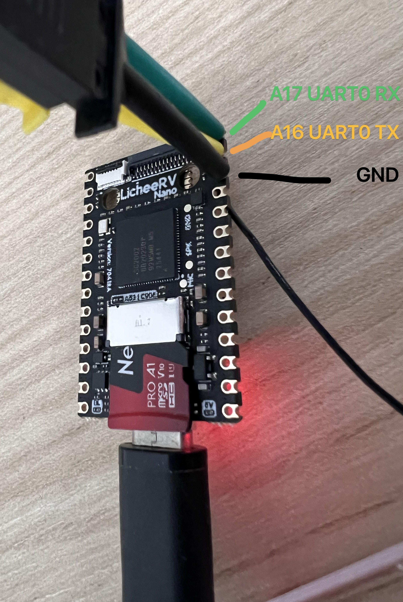
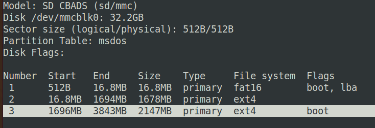
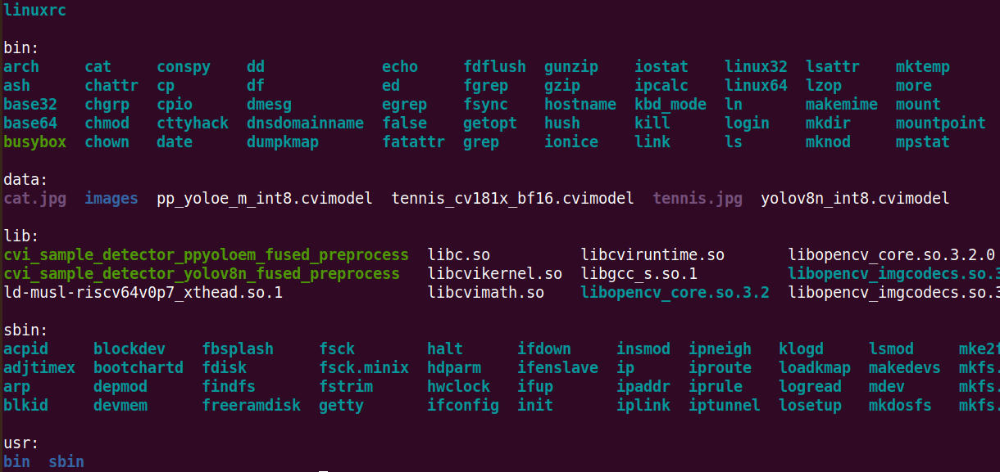
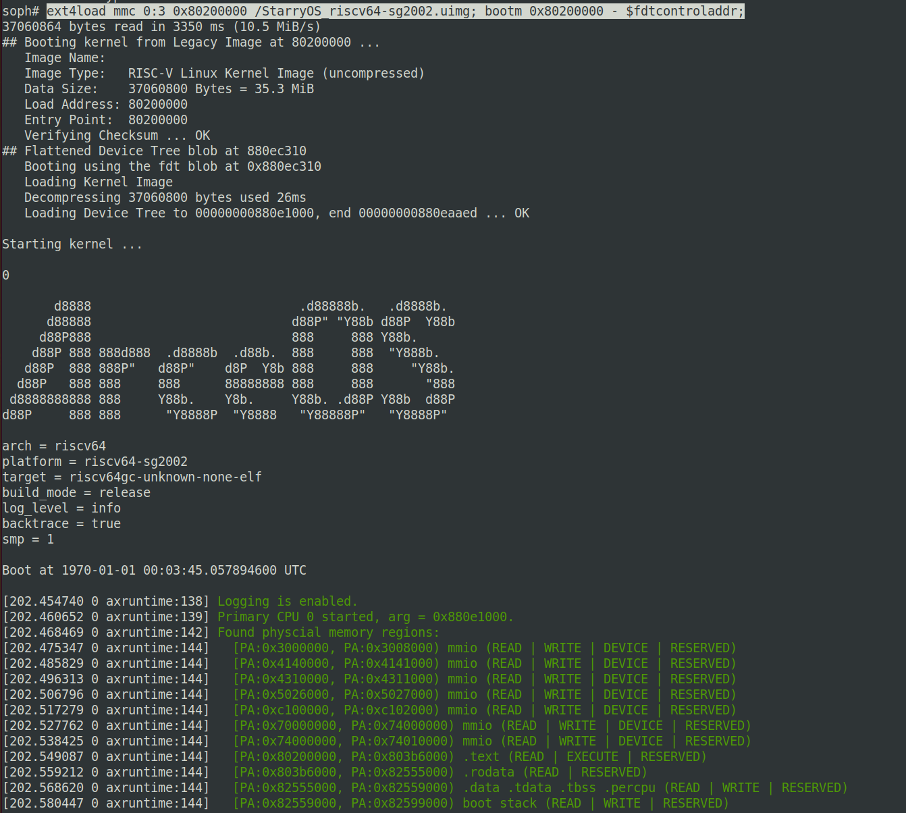
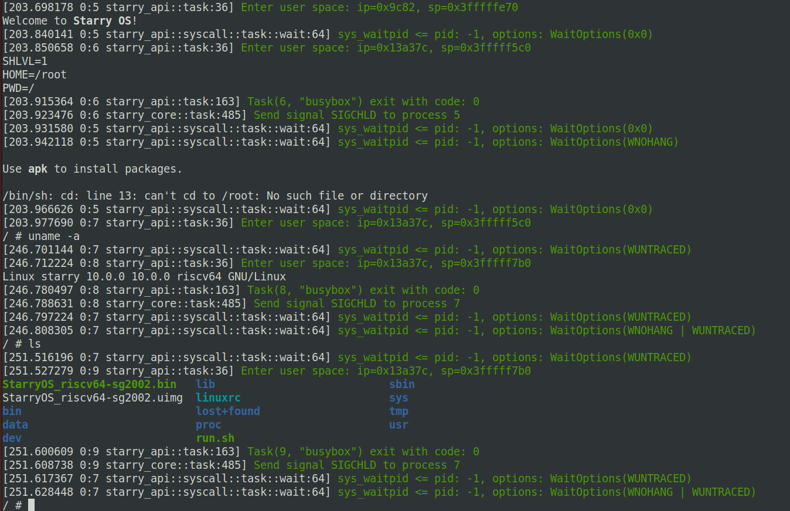

# SG2002 引导启动 StarryOS 指南

本文档说明如何在 SG2002 开发板上编译并启动 StarryOS，包括串口连接、StarryOS镜像构建、SD 卡制作和 U-Boot 引导等操作。

## 1. 串口连接

请将 SG2002 开发板 UART0 串口连接到以下引脚：
- `A17`（RX）接收
- `A16`（TX）发送
- `GND`     接地

串口波特率参数：`115200 8N1`。



## 2. 获取 StarryOS 源码并编译

### 拉取代码并 编译 SG2002 镜像

```bash
git clone https://github.com/elliott10/StarryOS.git -b sg2002-dev

cd StarryOS
make ARCH=riscv64 APP_FEATURES=sg2002 MYPLAT=axplat-riscv64-sg2002 BUS=mmio SMP=1 UIMAGE=y LOG=info build
```

编译完成后会得到U-Boot可引导的镜像：`StarryOS_riscv64-sg2002.uimg`。

## 3. 制作可引导 SD 卡

### 3.1 烧写基础系统镜像

先从以下页面下载 LicheeRV Nano 默认镜像并解压：

- https://github.com/sipeed/LicheeRV-Nano-Build/releases

然后将基础镜像写入 SD 卡（`/dev/sdX` 请替换为实际设备）：

```bash
dd if=xx.img of=/dev/sdX conv=sync status=progress
sync
```

### 3.2 新建 StarryOS rootfs 分区

在 SD 卡尾部新建一个分区（示例使用第 3 分区，大小约 4G），并将其设置为可引导：

```bash
sudo fdisk /dev/sdX
```

`fdisk` 交互流程示例：
- `n`：新建分区
- 设置大小（如 `+4G`）
- `a`：设置 bootable flag
- `3`：选择分区 3
- `w`：保存并退出

最终分区表示例如下图：



### 3.3 格式化 rootfs 分区为 ext4

```bash
sudo mkfs.ext4 -F -O ^metadata_csum_seed -L rootfs /dev/sdX3
```

### 3.4 准备并复制 rootfs 内容

下载预置的StarryOS rootfs 镜像：

- https://github.com/elliott10/axplat-riscv64-sg2002/releases/download/v0.1.0/ext4_riscv64_pzc.img

将下载镜像挂载后，把其中内容复制到 SD 卡新分区，并额外复制内核镜像 `StarryOS_riscv64-sg2002.uimg` 到该分区根目录。
完成后执行 sync及卸载sd卡。

StarryOS所需的根文件系统内容如下图所示：


## 4. U-Boot 引导 StarryOS

将制作完成的 SD 卡插入 SG2002 开发板，上电后通过串口快速进入 U-Boot 命令行，执行：

```bash
ext4load mmc 0:3 0x80200000 /StarryOS_riscv64-sg2002.uimg; bootm 0x80200000 - $fdtcontroladdr;
```
U-Boot命令行如下图所示：




启动成功后，StarryOS 会挂载 rootfs 并进入 shell。



## 5. 常见问题

- 串口无输出：板子默认没有焊接上外露的引脚，需要手动焊接或者使用引脚夹，然后对照连线图检查串口引脚是否接错。
- U-Boot 找不到镜像：确认镜像文件名和分区号是否一致（示例为 `mmc 0:3`）。
- rootfs 挂载失败：确认分区文件系统为 ext4，且标记为可引导的活动分区。
